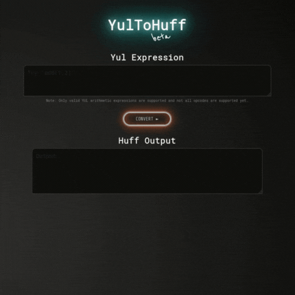

# YulExp2Huff •  

   

YulExp2Huff is a tool designed to convert simple Yul arithmetic expressions to their equivalent Huff code. The output generated is not currently optimized, and there is plenty of room for improvement. No input validations are in place atm since this tool has to support variables in Yul expressions as well. So invalid input will simply result in invalid output. 

## Motivation

I felt that the nested Yul statements are quite difficult to read. So I ended up creating this tool to easily understand the Yul arithmetic expressions.

## Getting Started

To use the application, simply enter a Yul expression into the input field and click the "Convert" button. The resulting Huff code will be displayed in the output field below.

> Note: This app is still in a very early stage. This project will be developed during my free time, so expect progress to be slow.

## TODO:
- [ ] Add input validations
- [ ] Stack comments in output?
- [ ] Support more Opcodes
- [ ] Transpile Yul blocks to Huff

## Running locally

To get a local copy up and running follow these simple steps:

- Clone the repo
- Install the dependencies: `npm i`
- Start the development server: `npm run dev`

## Contributing

- Found a bug? Create an issue!
- Like to implement a feature? Open a PR!

## Credits

This application was built using [Vite.js](https://vitejs.dev/) and [React](https://reactjs.org/). The code for the interface was taken from the [vEVM](https://github.com/kethcode/vEVM) project.

## License

This project is licensed under the MIT License - see the [LICENSE](LICENSE) file for details.

## Disclaimer

_This is supposed to be a educational resource and a fun project. No guarantee, representation or warranty is being made, express or implied, as to the safety or correctness of the output generated. They have not been audited and as such there can be no assurance they will work as intended, and users may experience delays, failures, errors, omissions, loss of transmitted information or loss of funds. The creators are not liable for any of the foregoing. Users should proceed with caution and use at their own risk._
